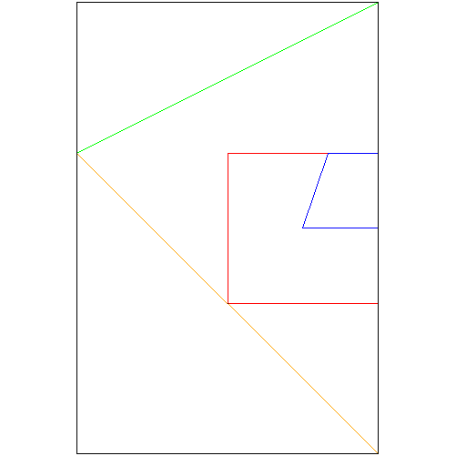
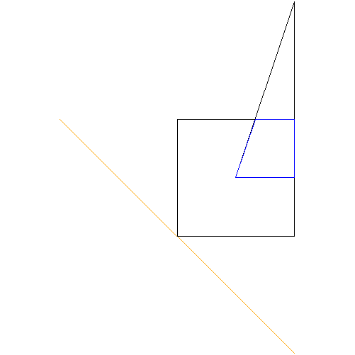
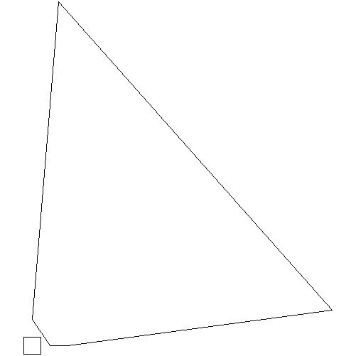

# Convex Polygon calculator

With this polygon calculator you will be able to store a series of convex polygon given his points and calculate various aspects as their area, their bounding box, print a polygon, calculate the intersection of two polygons... (see all functionalities in ```Functionalities```).

## Installation

Just download the folder. Even so, to compile the project you will need to install pngwriter:

### PNGwriter installation


```bash
git clone https://github.com/pngwriter/pngwriter.git

cd pngwriter

cmake -DPNGwriter_USE_FREETYPE=OFF -DCMAKE_INSTALL_PREFIX=$HOME/libs .

make

make install

cd ..

rm -rf pngwriter
```
## Functionalities

### The `polygon` command

The `polygon` command associates an identifier with a convex polygon made by a set of zero or more points. If the polygon identifier is new, it will create it. If it already existed, it will overwrite the previous polygon. New polygons are black.

### The `print` command

The `print` command prints the name and the vertices of a vertices of a given polygon. The output must only contain the vertices in the convex hull of the polygon, in clockwise order, starting from the vertex will lower X (and the vertex with lower Y in case of ties). They must be printed in a single line, with one space separating each value.

### The `area` command

The `area` command prints the area of the given polygon.

### The `perimeter` command

The `perimeter` command prints the perimeter of the given polygon.

### The `vertices` command

The `vertices` command prints the number of vertices of the convex hull of the given polygon.

### The `centroid` command

The `centroid` command prints the centroid of the given polygon.

### The `list` command

The `list` command lists all polygon identifiers, lexycographically sorted.

### The `save` command

The `save` command saves the given polygons in a file, overwriting it if it already existed. The contents of the file must be the same as in the `print` command, with a polygon per line.

### The `load` command

The `load` command loads the polygons stored in a file, in the same way as `polygon`, but retrieving the vertices and identifiers from the file.

### The `setcol` command

The `setcol` command associates a color to the given polygon.

### The `draw` command

The `draw` command draws a list of polygons in a PNG file, each one with its associated color. The image should be of 500x500 pixels, with white background and the coordinates of the vertices should be scaled to fit in the 498x498 central part of the image, while preserving the original aspect ratio.

### The `intersection` command

This command may receive two or three parameters:

- When receiving two parameters `p1`and `p2`, `p1`should be updated to the
- intersection of the original `p1` and `p2`.

- When receiving three parameters `p1`, `p2` and `p3`, `p1`should be updated
- to the intersection of `p2` and `p3`.

Take into account that identifiers may be repeated.

### The `union` command

Just as the `intersection` command, but with the convex union of polygons.

### The `inside` command

Given two polygons, the `inside` command prints `yes` or `not` to tell whether
the first is inside the second or not.

### The `bbox` command

The `bbox` command creates a new polygon with the four vertices corresponding to the bounding box of the given polygons.

## Errors

If any command contains or produces an error, the error will print a line starting with `error: ` and the command will be completely ignored (as if it was not given). Errors include:

- unrecognized command
- undefined polygon identifier

## The Polygon calculator

The Polygon calculator must read commands from the standard input and write their answers to the standard output. In some cases, it also should use some files.

The execution of the script using the calculator on the left should produce the output on the right:

<table>
<tr>
<td>

```
# Joc de proves

polygon p1 0 0 1 1 1 0 0 1
polygon p2 0.5 0.5 1 2 1 0.5
intersection p3 p2 p1
inside p3 p2
inside p2 p3
inside p3 p1
area p2
vertices p2
edges p1
save file.txt p1 p2
polygon p4 -1 1 1 -1
union p2 p4
intersection p5 p4 p1
bbox p6 p1 p2 p3 p4 p5
print p6
color p1
setcol p1 1 0 0
color p1
setcol p2 0 1 0
setcol p3 0 0 1
setcol p4 1 0.64 0
setcol p5 100 100 100
draw image.png p1 p2 p3 p4 p5 p6
load file.txt
draw image2.png p1 p2 p3 p4 p5
polygon p1 -1 1 -1 -1 1 1 1 -1
centroid p1
polygon p2 0 3 5 5 9 2 9 5 2 0 4 2 9 2 8 4 2 0 4 0 34 4 3 39 2 3 2 5 9 2 12 3 5 3 2 1
print p2
polygon p10
draw image3.png p2 p1
```

</td>
<td>

```
#

ok
ok
ok
yes
no
yes
0.375
3
4
ok
ok
ok
ok
ok
p6 -1.000 -1.000   -1.000 2.000   1.000 2.000   1.000 -1.000
red: 0.000  green: 0.000  blue: 0.000
ok
red: 1.000  green: 0.000  blue: 0.000
ok
ok
ok
error: all entries must be between 0 and 1, included.
ok
ok
ok
ok
0.000 0.000
ok
p2 0.000 3.000   3.000 39.000   34.000 4.000   4.000 0.000   2.000 0.000
ok
ok

```

</td>
</tr>
</table>

Moreover, the content of `file.txt` will be

```
p1  0 0  0 1  1 1  1 0
p2  0.5 0.5  1 2  1 0.5
```

and the images will be:

#### image.png




#### image2.png




#### image3.png



